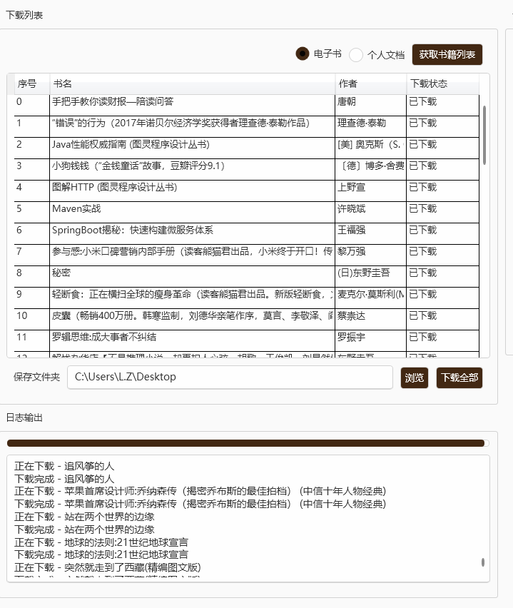
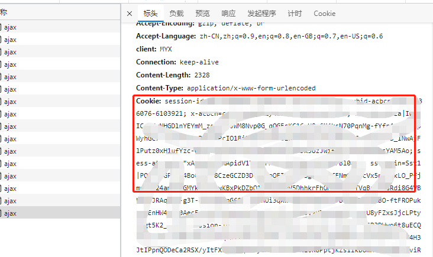
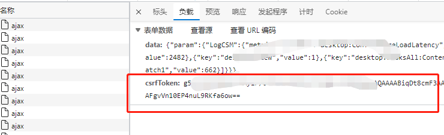

# KindleHelper-Desktop
 Kindle 电子书下载工具

## 命令行版本
[https://github.com/itgo067/KindleHelper](https://github.com/itgo067/KindleHelper)
## 使用说明

1. 填写cookie 和 csrf token ， 具体如何获取，下文有说明。
2. 选择电子书 或者 个人文档 ,选择对应的地区 - 中亚、美亚、日亚
3. 点击获取获取书籍列表，需要等待一会
4. 选择下载保存目录，点击下载全部进行下载
5. 日志输出栏目中有下载进度条和下载日志输出
6. 下载列表中，电子书下载完成会及时更新下载状态

## 获取 Cookie 和 csrfToken
首先是获取 cookie ， 打开亚马逊网站，F12 打开开发者工具中获取

然后是需要 获取 csrfToken， 打开 https://www.amazon.cn/hz/mycd/myx#/home/content/booksAll/dateDsc/， 查看源码， 搜索 csrfToken 复制后面的值就行。
或者在开发者工具中获取， 你只要点击到 内容和设备管理页面中， 在  开发者工具 找到 https://www.amazon.cn/hz/mycd/ajax ，任何一个上的header 上也是有的。

